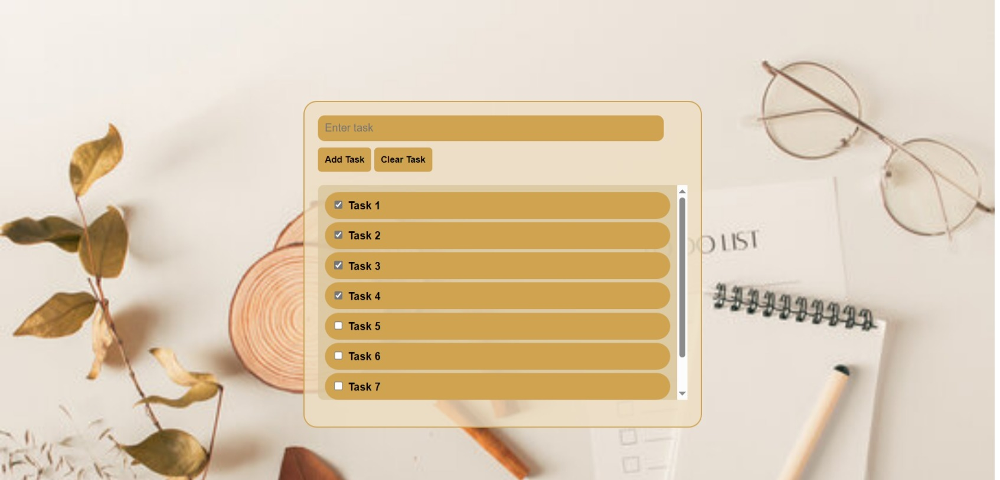

# ToDo List App
This is a simple To-Do List Application built using HTML, CSS, and JavaScript. It allows you to add tasks, clear tasks, and view your current list of tasks.

## Technologies Used

- HTML
- CSS
- JavaScript

## Getting Started

To get a copy of this project up and running on your PC, follow these simple steps:

1. Clone the repository to your PC
2. Open the `Index.html` file in your preferred web browser

## Overview 

## Usage

1. Enter a task in the input field and click "Add Task" to add it to your list
2. Click "Clear Task" to remove all tasks from your list
